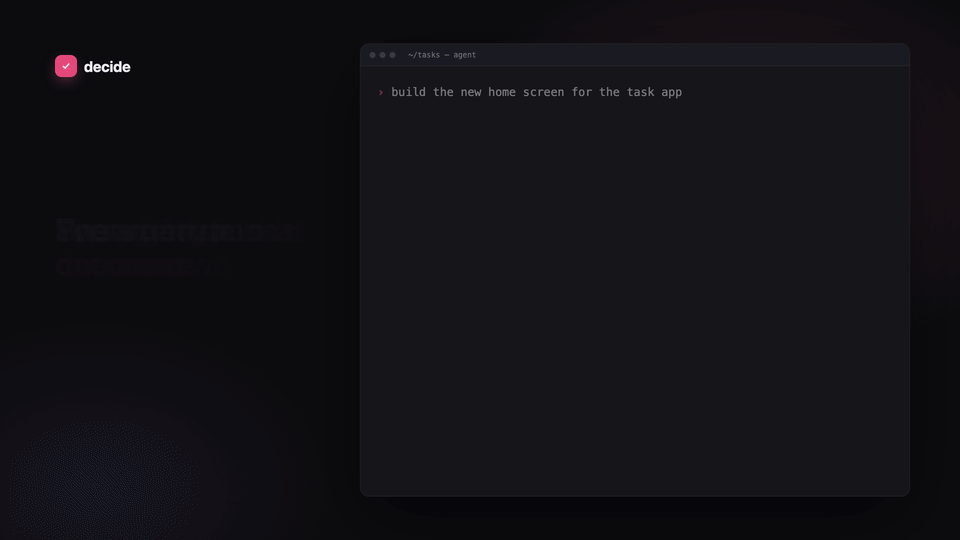
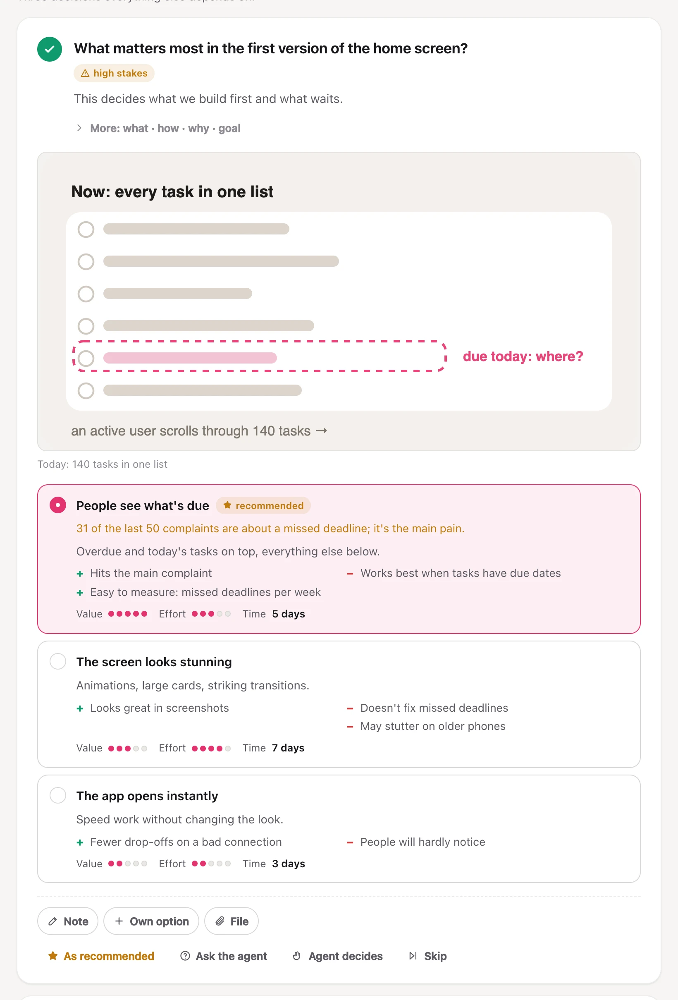
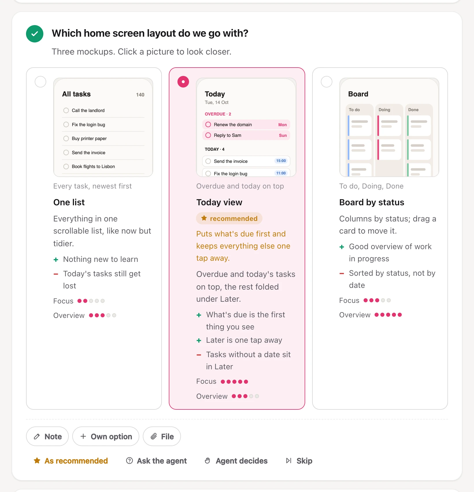
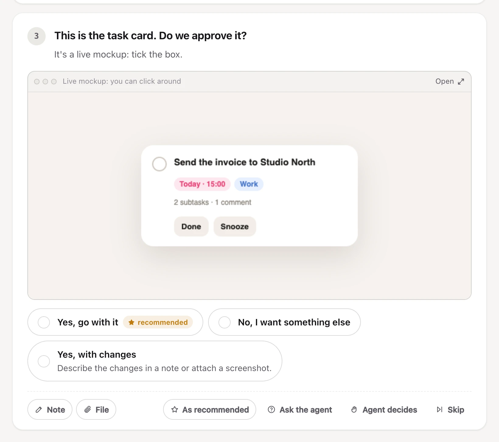
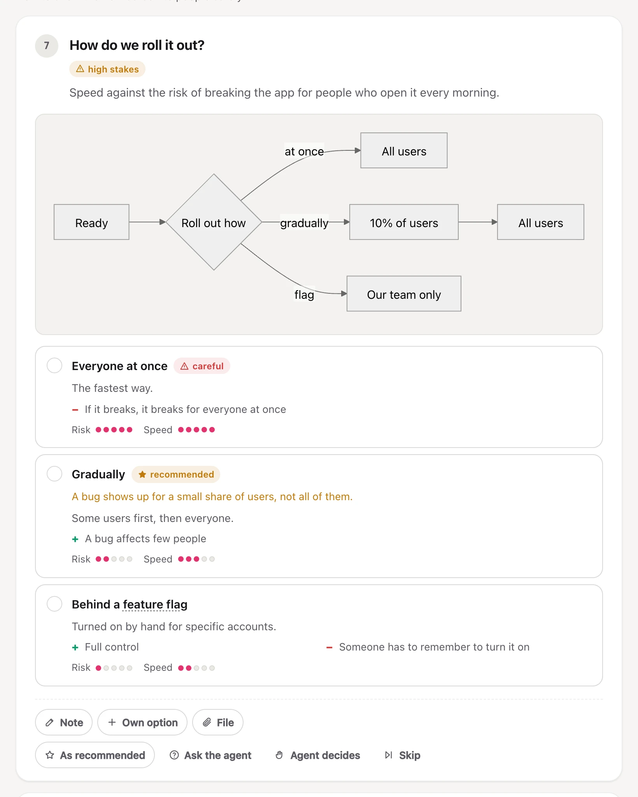
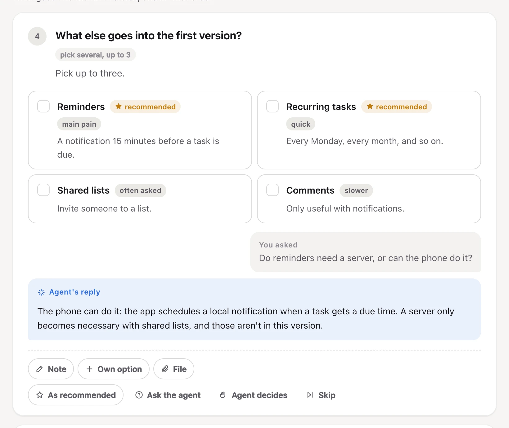
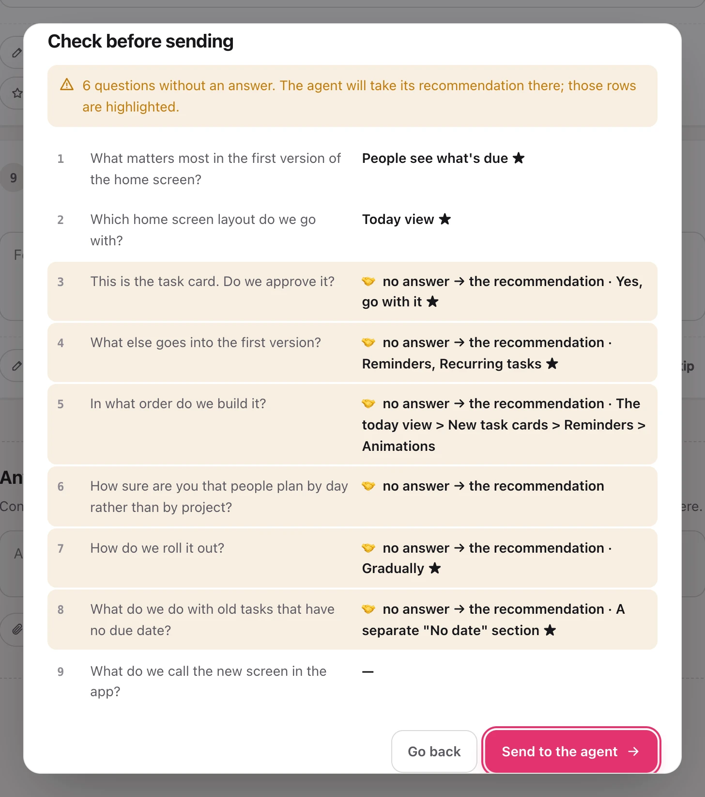
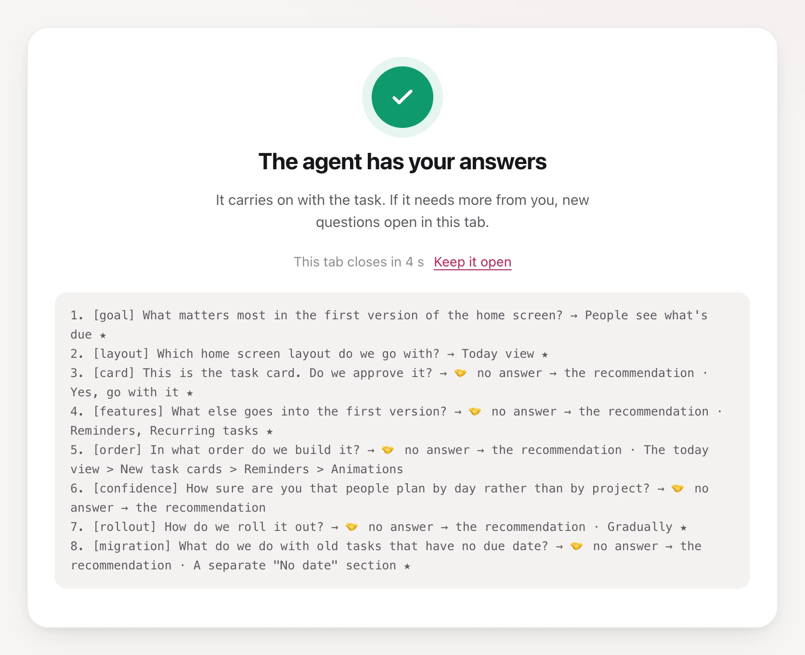

<div align="center">

# decide

**Your agent asks on a page. You answer in clicks.**

A plugin for Claude Code and Codex. When the agent needs you to choose,
you get a page with the questions, the options, the agent's pick with its
reason, and pictures of what you're choosing between. No more walls of
numbered questions in chat.

[](https://github.com/Forichok/decide/actions/workflows/test.yml)
[](LICENSE)


[Install](#install) · [When to use it](#when-to-use-it) · [Screens](#screens) · [How it works](#how-it-works) · [FAQ](#faq)



</div>

## The problem

You ask the agent to build a screen. Before it starts, it posts six numbered
questions with options a–c, two of them about things you've never heard of.
You reply "1b, 2 — what's a flag? 3 idk, 4 all of them?". The agent guesses
the rest. It couldn't show you the three layouts it had in mind, and it can't
tell which of your answers were real and which were "sure, whatever".

decide moves that exchange to a page built for it.

|                                | Answering in chat                           | Answering in decide                                                          |
| ------------------------------ | ------------------------------------------- | ---------------------------------------------------------------------------- |
| Six questions at once          | A numbered wall; you reply "1b, 2 yes, 3 ?" | One card per question, one click each, or the digits 1–9                     |
| Seeing what you choose         | Text descriptions                           | Screenshots of your running app, clickable HTML mockups, diagrams, code      |
| "What does this mean?"         | A new message, and the other answers wait   | Ask under the question; the agent answers right there while you go on       |
| Questions you don't care about | The agent guesses                           | The recommendation or no answer, you choose; it knows you didn't pick it     |
| Next week                      | Scroll up and hope                          | Every decision is kept per project, and the agent checks before asking again |

Claude Code's built-in question picker is fine for one quick choice: it takes
up to four questions with two to four options each. decide is for the rounds
that need more than that.

## When to use it

- You're about to start a feature and the agent has a list of questions for
  you.
- The choice is visual: two layouts, three card designs, before and after.
- Something is hard to undo, like a migration, a public API or pricing, and
  you want the agent's reasoning next to every option.
- The request is still vague, and the agent should interview you before it
  writes code.

Keep a single yes/no in chat. decide is for two or more choices that change
the result.

## How

1. Type `/decide` in Claude Code or `$decide` in Codex. Most of the time you
   don't have to: the agent opens decide on its own when a task has open
   choices.
2. A tab opens with every question. Click, or use the keyboard: 1–9 picks,
   J / K moves, ? lists the rest.
3. Not sure about a question? Ask under it. The agent answers on the page
   with text, a screenshot, a diagram or code.
4. Press Done. The tab closes, and the agent gets your answers and carries on.

## Screens

The page follows your system theme and your browser's language (English or
Russian).

<table>
<tr>
<td width="50%" valign="top">
<b>Options with a recommendation.</b> Each one has pros, cons and metrics.
The agent marks its pick and says why.
<picture>
  <source media="(prefers-color-scheme: dark)" srcset="docs/screens/options-dark.webp">
  
</picture>
</td>
<td width="50%" valign="top">
<b>Mockups side by side.</b> Click a picture to open it full size.
<picture>
  <source media="(prefers-color-scheme: dark)" srcset="docs/screens/compare-dark.webp">
  
</picture>
</td>
</tr>
<tr>
<td width="50%" valign="top">
<b>Live mockups.</b> The agent's HTML runs in a sandboxed frame, so you can
click around before you approve it.
<picture>
  <source media="(prefers-color-scheme: dark)" srcset="docs/screens/preview-dark.webp">
  
</picture>
</td>
<td width="50%" valign="top">
<b>Diagrams.</b> A mermaid chart shows where each option leads.
<picture>
  <source media="(prefers-color-scheme: dark)" srcset="docs/screens/diagram-dark.webp">
  
</picture>
</td>
</tr>
<tr>
<td width="50%" valign="top">
<b>Ask under the question.</b> The agent's answer lands right below yours.
<picture>
  <source media="(prefers-color-scheme: dark)" srcset="docs/screens/ask-dark.webp">
  
</picture>
</td>
<td width="50%" valign="top">
<b>Check before sending.</b> Unanswered questions are highlighted. The agent
takes its recommendation there or leaves them open, or you go back and fill them
in.
<picture>
  <source media="(prefers-color-scheme: dark)" srcset="docs/screens/review-dark.webp">
  
</picture>
</td>
</tr>
</table>

## What the agent gets

One line per question, plus a JSON file with every detail. Each line says
whether the answer was yours or the agent's own recommendation, so it knows
what you actually decided.

<picture>
  <source media="(prefers-color-scheme: dark)" srcset="docs/screens/done-dark.webp">
  
</picture>

Follow-up rounds open in the same tab. The page also shows whether the agent
is still listening: if it stepped away, your answers are saved and the page
gives you a one-line message to send it.

## Install

You need Node.js 20 or newer. Screenshots of running pages use a local
Chrome, Chromium, Edge or Brave if there is one.

Claude Code:

```
/plugin install decide --marketplace Forichok/decide
```

Claude Code older than 2.1.275 needs two steps:

```
/plugin marketplace add Forichok/decide
/plugin install decide@forichok
```

Codex:

```bash
codex plugin marketplace add Forichok/decide
codex plugin add decide@forichok
```

Start a new agent session afterwards.

To look around without installing anything, clone the repo and run
`node decide.mjs --demo`.

## Commands

In Claude Code the command is `/decide`; in Codex it's `$decide`. If another
command in your setup already uses `/decide`, type the full `/decide:decide`.

| Type                       | What happens                                            |
| -------------------------- | ------------------------------------------------------- |
| `/decide`                  | The agent collects the open choices of the current task |
| `/decide <topic>`          | A short interview about the topic before work starts    |
| `/decide demo`             | The feature tour                                        |
| `/decide history`          | What was already decided in this project                |
| `/decide x.questions.json` | Runs a spec you or the agent wrote                      |

## How it works

The plugin ships an MCP server with five tools: `ask` opens a round, `wait`
blocks until you answer or ask something, `explain` puts the agent's answer
on the page, `screenshot` captures a running page, and `history` searches
past decisions. Agents without MCP can run the same engine as a CLI
(`node decide.mjs --help`).

A small server per project serves the page on 127.0.0.1. It starts on demand
and stops after 30 idle minutes. Its state, the decision journal and
screenshots live in `~/.decide/projects/<project>/` (set `DECIDE_HOME` to
move them). There are no dependencies, no build step and no telemetry.

The agent's guide is [skills/decide/SKILL.md](skills/decide/SKILL.md), and
the full spec and answers format is in
[skills/decide/spec.md](skills/decide/spec.md). The smallest round looks like
this:

```json
{
  "questions": [
    {
      "id": "db",
      "title": "Which database do we use?",
      "options": [
        { "id": "pg", "label": "Postgres", "recommended": "we already run it" },
        { "id": "sqlite", "label": "SQLite" }
      ]
    }
  ]
}
```

## Security

The server listens on 127.0.0.1 only, rejects requests with a foreign `Host`
header and requires an `x-decide` header on every write. Mockups run in a
sandboxed frame with no network access. Screenshots take http(s) URLs only.

## FAQ

**Does anything leave my machine?**
No. The page, your answers and the journal stay on 127.0.0.1 and in
`~/.decide`. The one outside request is mermaid, loaded from jsDelivr, and
only for rounds that have a diagram.

**I closed the tab halfway through.**
Your answers are saved as you go. Open the same link again and carry on.

**The agent stopped waiting before I pressed Done.**
Codex can end its turn while you're still answering. The page says so and
keeps your answers. Send the agent the message the page gives you, and it
picks them up.

**Can I use it with another agent?**
Anything that can run a shell command can use the CLI:
`node decide.mjs --help`.

## Development

```bash
node --test
```

The tests start real servers in temp directories and never touch your
`~/.decide`. CI runs them on Linux, macOS and Windows.

If decide saved you a round of "1b, 2 yes", a ⭐ helps other people find it.

## License

[MIT](LICENSE)
